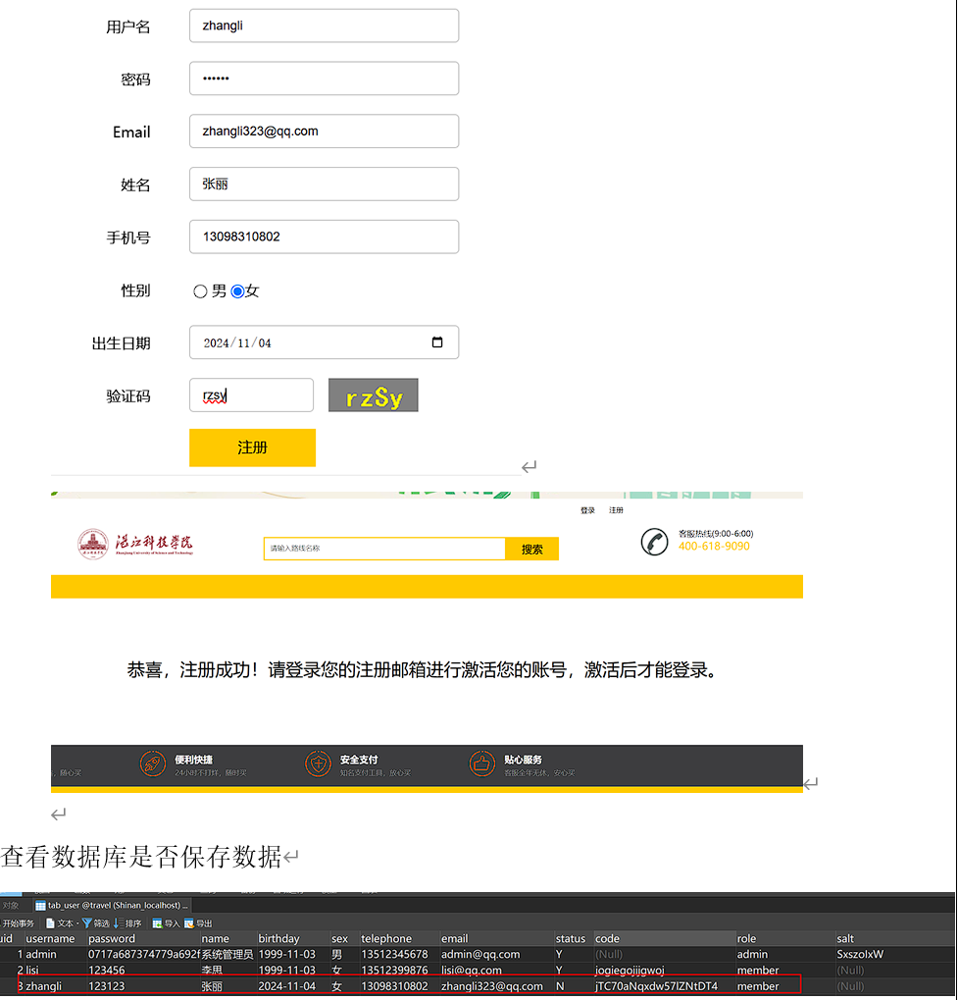
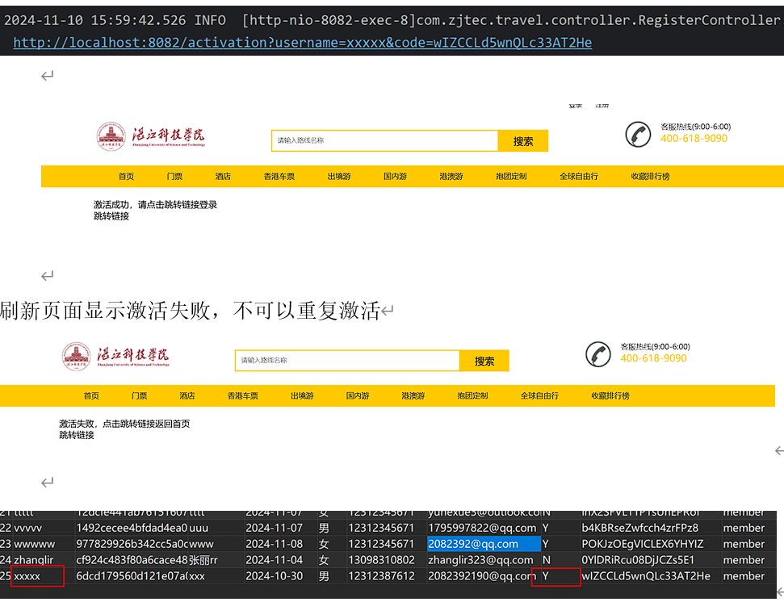
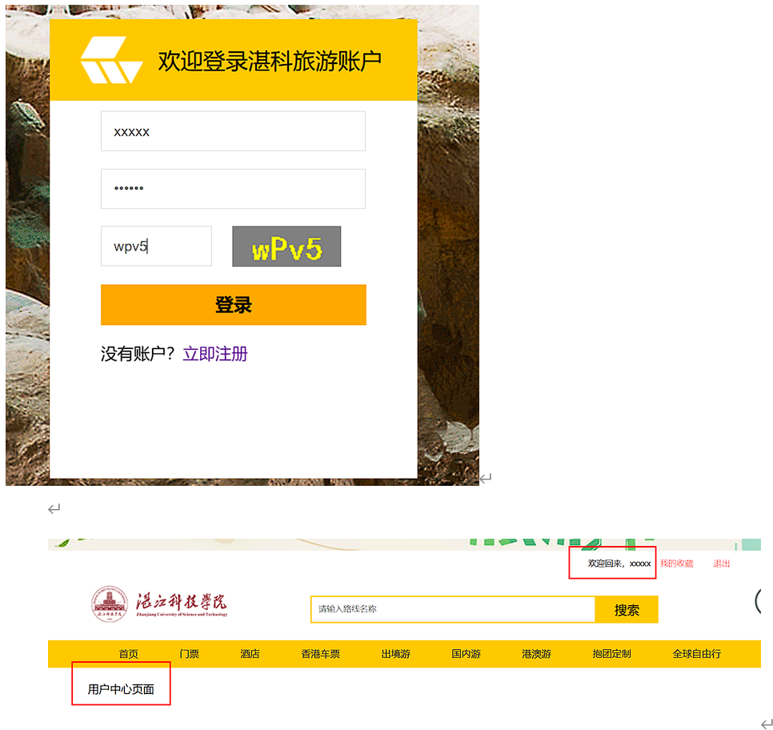
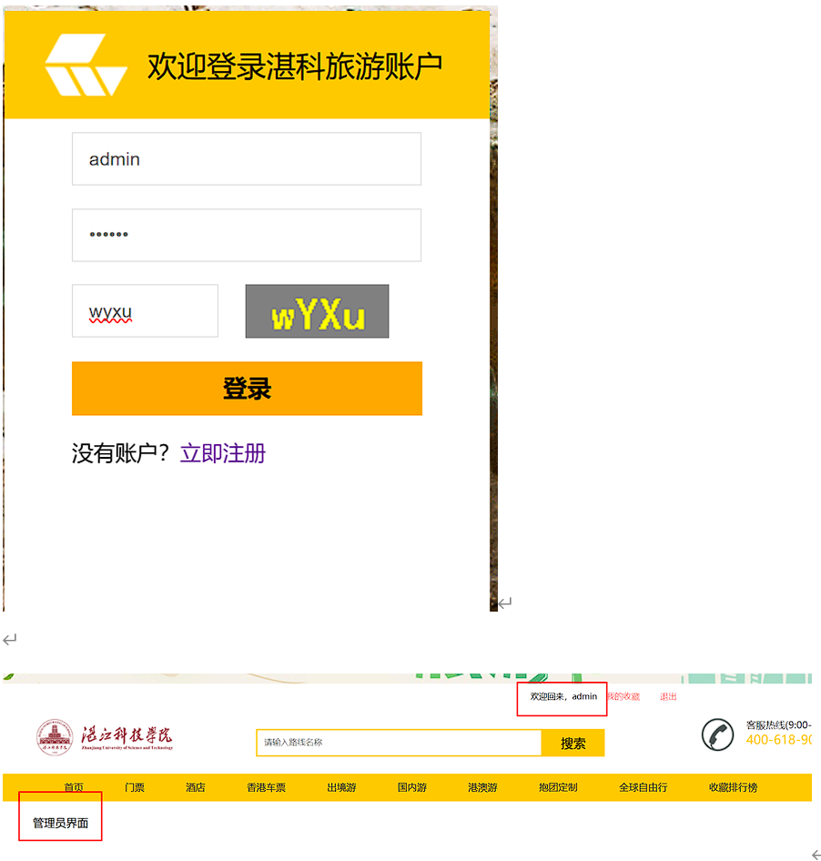
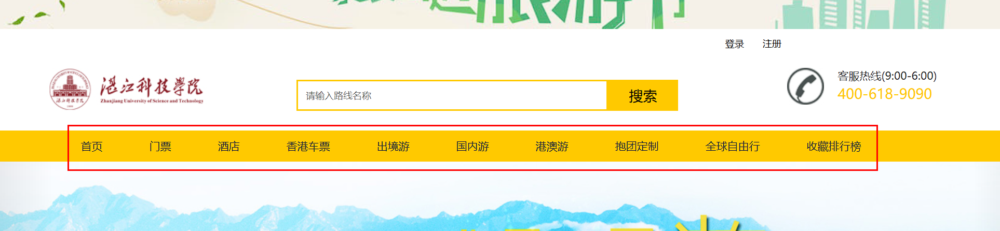
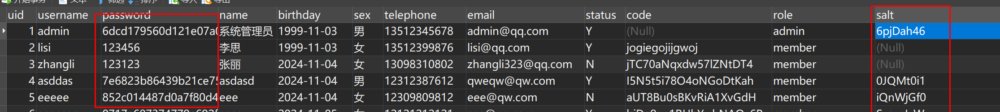
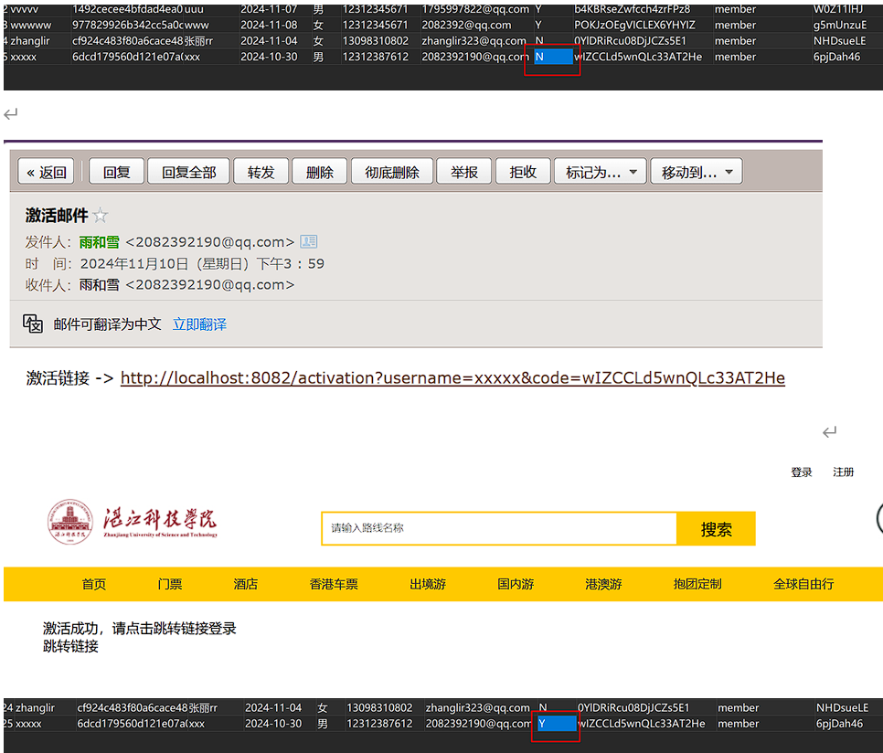

* 在学校实验室独立完成的项目

* 掌握搭建Web企业级开发环境、导入项目和开发调试、Web企业级项目注册、激活、登录和加载信息等功能开发实现。

* 形成独立思考的习惯和分析故障、排除故障的方法与技能。

* 效果展示

* 注册功能

* 激活功能

* 登录功能
普通用户

管理员

* 目录菜单加载功能

* 产品列表加载功能

* 用户密码加密功能

* 产品详细信息页面动态数据加载

* 邮件发送功能

